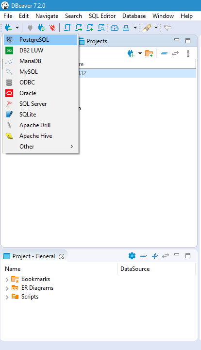
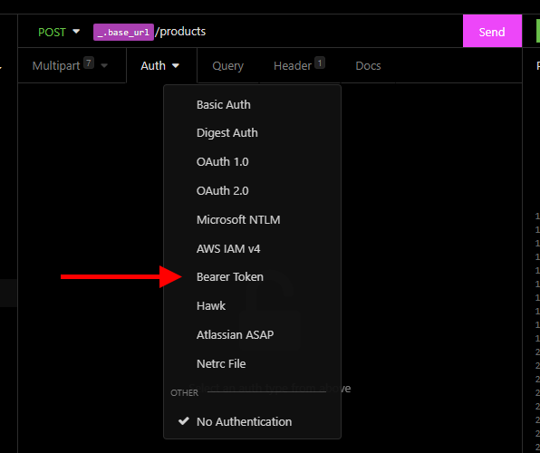

# **API - Registro de Produtos**
Aplicação back-end com NodeJS + TypeScript para cadastro de usuários e produtos, com autenticação, upload de arquivos e banco relacional.

## EXECUTANDO A SOLUÇÃO

### Passo 1: Instalando o Banco de Dados
É necessário ter o **PostgreSQL** instalado no computador ou ter uma instância deste banco em execução no Docker.

*OBS: Guarde o usuário e a senha de acesso ao banco que definiu durante a instalação, caso esteja utilizando o Docker e executou a linha de comando presente neste README para iniciar o container, o usuário é "postgres" e a senha também é "postgres".*

**Opção 1: Instalando o PostgreSQL no computador**

Baixe o instalador do PostgreSQL clicando [aqui](https://www.postgresql.org/download/), selecionando o instalador respectivo ao seu sistema operacional, e em seguida o execute para realizar a instalação.

**Opção 2: Utilizando o Docker**

Caso ainda não tenha o Docker instalado, clique [aqui](https://www.docker.com/products/docker-desktop), baixe e execute o instalador.

Para iniciar uma instância do PostgreSQL no Docker, execute o seguinte comando no terminal:

- *docker run --name api-cadastro-produto -e POSTGRES_PASSWORD=postgres -p 5432:5432 -d -t postgres*

*OBS: Se desejar pode utilizar outra porta para o banco, mas posteriormente uma configuração a mais deve ser realizada na conexão da aplicação com o banco de dados.*

**Continuando**

Com o PostgreSQL pronto, crie um banco nomeado de **product-registration**, para isso pode se usar softwares como o **DBeaver** (caso deseje instalar esta ferramenta clique [aqui](https://dbeaver.io/download/)), veja abaixo:

*Criando uma conexão com o Postgres*

 

 
*Criando o Banco de Dados da Aplicação*
 

 

### Passo 2: Clonando o Repositório

Com o terminal de comandos aberto na pasta que deseja armazenar o projeto, execute o comando abaixo:

- *[git clone https://github.com/Vinicius7Dev/nodejs-registro-produtos.git](https://github.com/Vinicius7Dev/nodejs-registro-produtos.git)*

Com o repositório clonado, acesse a pasta do projeto executando "*cd .\nodejs-registro-produtos\*"

Em seguida, para instalar as dependências do projeto, execute o comando "*npm install*" ou se tiver o *Yarn* instalado você pode optar por executar "*yarn*"

### Passo 3: Conexão com o Banco de dados

Primeiramente, abra o arquivo *ormconfig.json* que está na raiz do projeto (a pasta inicial do projeto), e:
- Certifique-se de que os campos de usuário (*username*) e senha (*password*) são os mesmos que foram configurados durante a instalação do banco de dados;
- Confira também se a porta (*port*) também é a mesma definida na instalação do banco.

Em seguida, com o terminal ainda aberto na raiz do projeto, execute:

- *npm run typeorm migration:run* ou *yarn typeorm migration:run* (caso tenha o *Yarn* instalado)

*OBS: Se o terminal retornar um erro, provavelmente as configurações de conexão ao banco presentes no ormconfig.json estão incorretas ou o banco 'product-registration' não foi criado.*

### Passo 4: Arquivo .env

Na raiz do projeto existe um arquivo com o nome "*.env.example*", renomeie ele para "*.env*" apenas e, caso deseje, pode alterar o campo "*JWT_SECRET*" para uma chave secreta buscando gerar tokens de autenticação mais seguros.

### Passo 5: Executar o projeto

Com todos os passos anteriores realizados em ordem, basta executar no terminal que ainda está aberto na raiz do projeto o comando "*npm run dev*" ou "*yarn dev*", e aguardar a mensagem "*===> Server started on PORT 3333 <===*" aparecer, indicando que o servidor está em execução.

## ROTAS

*OBS: Todas as rotas que enviam dados pelo corpo da requisição trabalham com o JSON;*

*OBS2: As imagens de exemplo abaixo são do software <strong>Insomnia</strong>, caso deseje utilizar outro programa não tem problema, clique [aqui](https://insomnia.rest/download) e acesse o site oficial para download desta ferramenta;*

*OBS3: As rotas autenticadas utilizam o Bearer Token, para configurar este token siga os passos abaixo (no Insomnia):*

 

 

#### Cadastro de Usuários

- **POST**: *http://localhost:3333/users*
- Corpo da Requisição:
  - name: string;
  - email: string;
  - password: string;
- Retorno: Dados do usuário cadastrado.

#### Autenticação

- **POST**: *http://localhost:3333/sections*
- Corpo da Requisição:
  - name: string;
  - email: string;
- Retorno: Dados do usuário + token de autenticação.

#### Cadastro de Categorias

- **POST**: *http://localhost:3333/categories*
- Autenticação (Auth):  Bearer Token
- Corpo da Requisição:
  - name: string;
  - description: string;
- Retorno: Dados da categoria cadastrada.

#### Cadastro de Produtos

- **POST**: *http://localhost:3333/products*
- Autenticação (Auth):  Bearer Token  
- Corpo da Requisição:
  - name: string;
  - description: string;
  - price: number;
  - category_id: string (uuid);
  - images: Arquivo de imagem (Pode enviar mais de um campo com este nome)
- Retorno: Dados do produto cadastrada.

#### Listagem dos Produtos

- **GET**: *http://localhost:3333/products*
- Autenticação (Auth):  Bearer Token
- Parâmetros "Query" opcionais aceitos na Rota para filtragem:
  - product_name?: string;
  - min_price?: number;
  - max_price?: number;
  - category_name?: string;
- Retorno: Dados dos pedidos cadastrados (com ou sem filtragem).

#### Apagar um Produto

- **DELETE**: *http://localhost:3333/products/:id* (id = id do produto à remover)
- Autenticação (Auth): Bearer Token  
- Parâmetros da Rota:
  - id: string (uuid);
- Retorno: Vazio.

#### Acessar uma Imagem de um Produto

- **GET**: *http://localhost:3333/files/nome_da_imagem_aqui*
- Retorno: Imagem do Produto.

